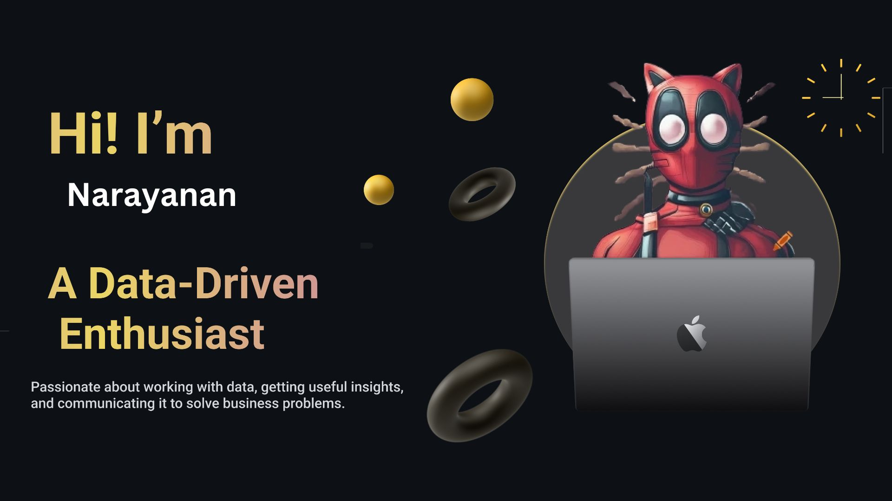

 

I'm a data analyst who loves working with data to find patterns, insights, and solutions.

## 🚀 About Me

- 🎓 I'm currently doing an **Data Analyst internship** and love **playing with data** to uncover insights.
- 🔍 Passionate about **exploring** data and solving real-world problems.
- 🛠 I have experience in **Python, SQL, Excel, Power BI, Tableau, Machine Learning, and Statistics**.s.
- 📈 Interested in **predictive analytics** to drive business decisions.
- 🏆 Strong analytical and problem-solving skills to tackle challenging data issues.
## 🎉 Fun Fact
- I enjoy learning about **new AI advancements** and applying them to real-world data problems.
- I believe **data storytelling** is as important as analysis—numbers tell great stories!
